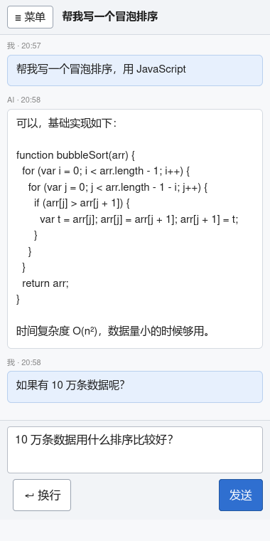
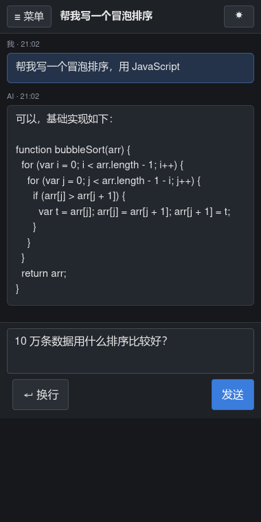
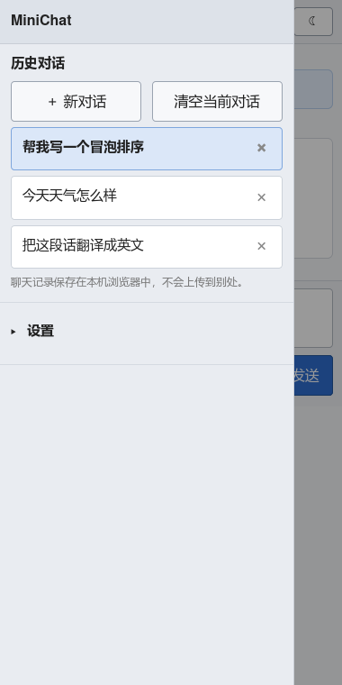
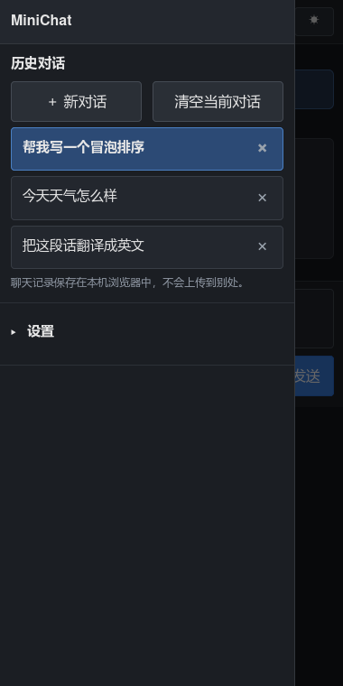
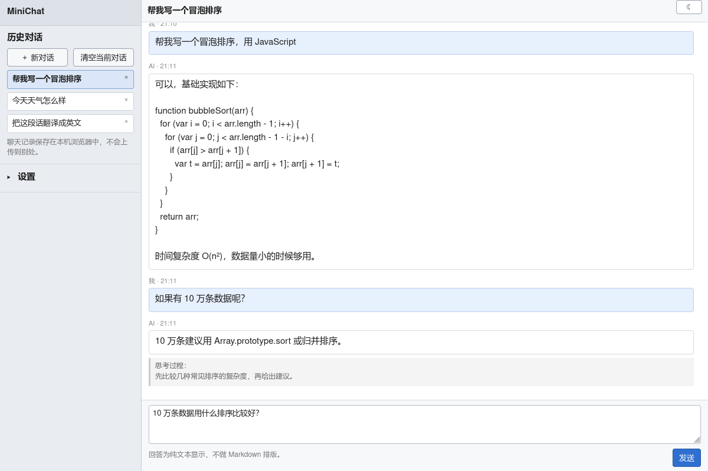
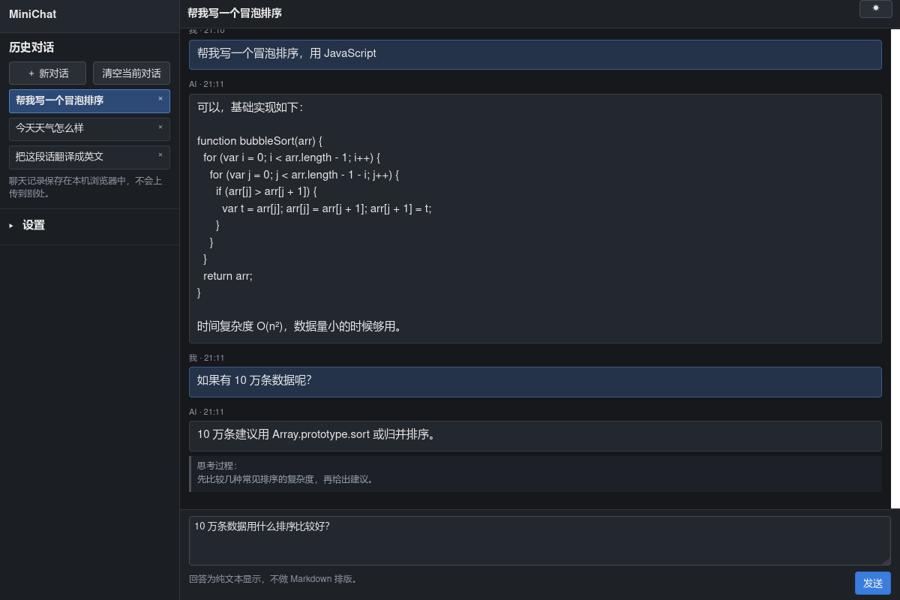
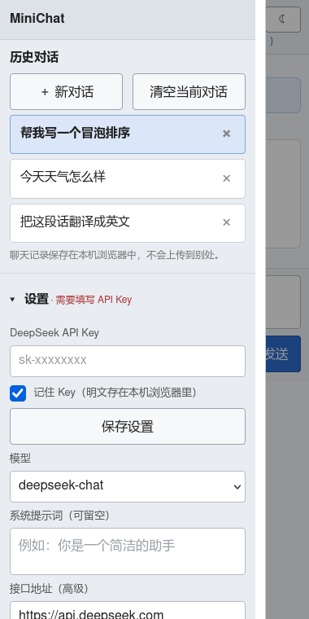
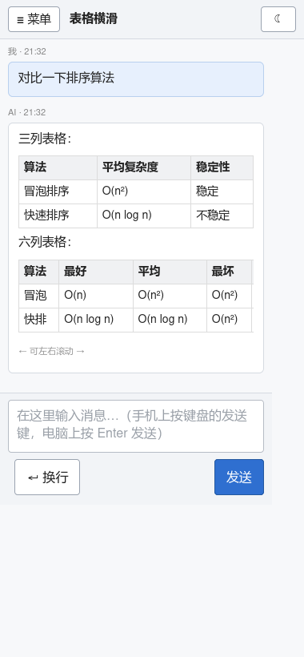

# MiniChat —— 极简 DeepSeek 对话网页

不依赖任何框架、不需要构建、不需要后端的单页聊天工具。API Key 由使用者自己在页面上填写。
**以手机体验为主**，同时为老浏览器（Safari 12 / 2018 年左右的浏览器）编写，因此刻意牺牲外观，
只保留最基础的对话功能。

截图：

| | 浅色 | 深色 |
| --- | --- | --- |
| **手机** |  |  |
| **手机 · 菜单抽屉** |  |  |
| **电脑** |  |  |

## 使用方法

### 手机上（推荐这样用）

手机浏览器不方便打开本地文件，所以用电脑当静态服务器、手机同网访问：

```bash
cd minichat
python3 -m http.server 8000
```

- 电脑：浏览器打开 `http://127.0.0.1:8000/`
- 手机（连同一个 Wi-Fi）：打开 `http://<电脑的局域网IP>:8000/`

查电脑局域网 IP：macOS 用 `ipconfig getifaddr en0`，Linux 用 `hostname -I`。

iPhone 上可以再点「分享 → 添加到主屏幕」，之后从桌面图标打开是全屏的（页面已带
`apple-mobile-web-app-capable`），而且不会被 Safari「7 天没访问就清理存储」的策略清掉聊天记录。

### 电脑上

直接双击 `index.html` 也能用（`file://` 打开已实测可正常调用 DeepSeek 接口）。

### 然后

1. 点左上角 **☰ 菜单** 打开侧栏，填入 **DeepSeek API Key**（形如 `sk-xxxx`），点 **保存设置**。
2. 输入内容，按键盘上的**发送键** / 点 **发送**。

> 不点“保存设置”直接发送也可以，发送时会自动同步侧栏里的内容。

## 部署到 GitHub Pages

**可以直接传，不用改任何代码**：纯静态、无构建步骤、无后端，所有引用都是相对路径，
放在仓库根目录或子目录都能正常工作（已用子路径模拟验证过）。

```bash
cd minichat
git init && git add . && git commit -m "minichat"
git branch -M main
git remote add origin https://github.com/<你的用户名>/<仓库名>.git
git push -u origin main
```

然后仓库 **Settings → Pages → Source** 选 `Deploy from a branch`，分支选 `main` / 目录选 `(root)`，
等一两分钟访问 `https://<你的用户名>.github.io/<仓库名>/`。

几点说明：

- **不用怕公开仓库**：API Key 是访问者在自己的浏览器里填的，不写在代码里，所以不会泄露。
  唯一要小心的是别把 Key 直接写进文件再 push。
- **HTTPS 没有混合内容问题**：Pages 是 https，接口也是 https。
- **已实测**：接口的 CORS 会回显 `https://<用户名>.github.io` 这个来源，浏览器可以直连。
  也就是说部署到 Pages 比用 `file://` 双击打开更省心（Pages 是正常的 http(s) 来源）。
- **`.nojekyll`**：一个空文件，让 Pages 跳过 Jekyll 处理。本项目文件名不含下划线，
  其实不加也能跑，加上是为了以后新增文件时少踩坑。
- **`test/` 和 `doc/` 可以不传**：前者是 Node 测试、后者是截图，删掉不影响页面运行。
- **一个安全提醒**：`localStorage` 按**来源**隔离，`https://<用户名>.github.io` 下所有仓库
  共用同一份存储。所以如果 Key 存在别人部署的 Pages 上，那个页面理论上也能读到；
  用自己的仓库、或把「记住 Key」勾掉（Key 只在本次会话有效）就没这个问题。

## 手机上的交互

- **抽屉式侧栏**：整个侧栏默认收起，点 ☰ 呼出，点空白处或选中对话后自动收起。
  这样进来看到的就是聊天内容，不是一大片设置项。
- **侧栏里历史对话在最上面**：打开侧栏先看到对话列表，以及并排的「＋ 新对话 / 清空当前对话」；
  设置收在下面的「设置」里，点标题栏即可展开 / 收起。
- **设置默认展开还是收起，取决于你填没填 Key**：没填就自动展开并标红「需要填写 API Key」
  （否则新用户根本找不到填 Key 的地方）；填过就默认收起，把位置让给对话列表。
  你手动点过一次之后，就按你的选择记住。没填 Key 时点发送也会自动帮你展开设置。

第一次打开（还没填 Key）长这样：


- **换行按钮**：手机键盘没有 Shift，所以单独给了一个 **↵ 换行** 按钮（电脑上隐藏，用 Shift+Enter）。
- **输入框不会掉到键盘后面**：手机上不用 `position:fixed` 固定输入框，而是让它待在正常文档流里。
  老 iOS Safari 对固定定位元素遇键盘的处理不可靠（容易被键盘盖住），用文档流则由系统
  自动把输入框滚到键盘上方——这是老系统上最稳的做法。
- **字号 16px**：iOS 上输入框字号小于 16px 时，聚焦会自动放大整个页面。所有输入控件都是 16px。
- **触摸目标**：按钮、对话条目、删除×都是 44px 级别，手指点得中。
- **不被消息拽着跑**：你往上翻看历史时，新回答不会强行把你拉回底部（只在你自己发消息、
  或在底部附近时才自动滚动）；离底部较远时右下角会出现 **↓** 回到底部。
- **刘海屏**：`viewport-fit=cover` + `safe-area-inset`，顶栏和输入区不会被刘海/home 指示条压住。
- 提示信息会自动消失，不长期占着顶栏。

## 深色模式

- **顶栏右上角一键切换**：按钮显示 ☾ 表示当前是浅色（点一下变深），☀ 表示当前是深色。
- **侧栏「外观」三选一**：跟随系统 / 浅色 / 深色，选择立即生效并保存。
- 选择存在 `minichat.settings.v1` 里，刷新、重开浏览器都保留。
- 切换时连手机状态栏颜色（`<meta name="theme-color">`）一起改，老浏览器忽略这条。

兼容性处理：

| 点 | 做法 | 老浏览器会怎样 |
| --- | --- | --- |
| 颜色怎么切 | 只切 `<html>` 上的 `class`，颜色全写在 CSS 的 `html.dark` 作用域里 | `className` 是最古老的能力，任何浏览器都行 |
| 为什么不用 CSS 变量 | `var()` 要 Safari 9.1 / Android 4.4+ | 变量化写法在更老的浏览器上会变成**没有颜色**的页面，所以宁可多写几十行 |
| 打开瞬间闪白 | `<head>` 里一段内联脚本，在首次绘制前就把 class 定好 | 纯 ES5，失败也只是退回浅色 |
| 跟随系统 | `prefers-color-scheme`（Safari 12.1+ 才有） | 不支持时一律按浅色，手动切深色照常可用 |
| 原生控件/滚动条 | CSS `color-scheme` | 不认识就忽略，输入框和下拉框颜色由我们的 CSS 决定 |
| 输入框占位符 | 给 `::-webkit-input-placeholder` / `::-moz-placeholder` 各写一条 | 前缀选择器分别写，避免其中一条不认识导致整条规则被丢弃 |

## 功能

- 用户输入 → AI 回答，多轮上下文（每次最多带最近 30 条，节省 token）
- API Key / 模型 / 系统提示词 / 接口地址 / 外观都在侧栏「设置」里（可折叠）
- 模型可选 `deepseek-chat` 与 `deepseek-reasoner`（推理模型的思考过程以灰色小字单独显示）
- **新开对话**：多个对话可切换、删除
- **清空当前对话**
- **聊天记录持久化**：存在浏览器 `localStorage`，关页面、重启浏览器都还在
- 错误分类提示：Key 无效 401、余额不足 402、限流 429、超时、网络/跨域失败等
- 回答支持**基础 Markdown 排版**（可在设置里关掉），详见下一节
- **流式输出**：边生成边显示；可关掉，浏览器不支持时自动降级，见再下一节
- 无论是否 Markdown，都不经过 `innerHTML`，不存在注入问题

## Markdown 排版

AI 的回答默认按 Markdown 排版（**用户自己发的消息保持原样**，免得打几个 `*` 就变样），
在「设置 → 回答用 Markdown 排版」里可以一键关掉对比效果。

| 语法 | 效果 |
| --- | --- |
| `**粗体**` / `*斜体*` / `~~删除~~` | 粗体 / 斜体 / 删除线 |
| 反引号包起来的行内代码 | 灰底等宽字体 |
| 三个反引号围起来的代码块 | 独立代码框，**长行自动换行**（窄屏不横滑） |
| `#` ~ `######` | 一 ~ 六级标题 |
| `-` / `1.` 开头 | 无序 / 有序列表（缩进的续行会并进同一条） |
| `>` | 引用 |
| `---` | 分隔线 |
| `[文字](https://…)` | 链接，新标签页打开 |
| 竖线分隔的行 + 一行 `---` 分隔行 | 表格，支持 `:--` / `--:` / `:-:` 左 / 右 / 居中对齐 |

表格在窄屏上**按列数决定"挤"还是"滑"**：

- **4 列以内**：表格缩到气泡宽度，单元格折行适配（比横滑好读）
- **5 列以上**：每列至少留 5em，表格因此比气泡宽，由外面那层壳**横向滚动**；
  同时下面出现一行「← 可左右滚动 →」提示，免得看起来像被截断了
- 表头不折行（否则列一多，"算法"会被拆成两行一个字，看着像坏了）
- 提示是**量出来的**（表格实际宽度 > 容器宽度），且必须在**布局算完之后**才判 ——
  在 DOMContentLoaded 里读 `offsetWidth` 实测拿到的是 0，所以判定放在 load、
  渲染后延时、以及窗口尺寸变化时；横屏变宽了会把提示撤掉

> 阈值是 `app.js` 里的 `TABLE_COL_MIN_EM`（每列最小 em 数），改这个数字就能调整"几列开始横滑"。

手机上 380px 宽的实际效果（上面 3 列不滑，下面 6 列可左右滑动）：



刻意**不做**的（都是取舍，不是漏了）：列表嵌套、图片（`` 会渲染成普通链接，
**不会真的去加载图片**）、裸网址自动变链接、以及用 `_下划线_` 表示斜体
（那会把 `my_var_name` 这类变量名改坏）。

为什么不影响兼容性：

- 解析就是**正则 + 字符串**，没引入任何新 API；正则也避开了 ES2018 才有的
  lookbehind / 命名分组 / dotAll，老浏览器不会直接 `SyntaxError`。
- 所有文字都走 `createTextNode`，**全程不用 innerHTML**。模型输出里的
  `<script>`、`` 只会原样显示成文字，结构上不可能变成标签。
- 链接只允许 `http` / `https` / `mailto`，`javascript:`、`data:` 一律退化成纯文字。
- 量词都带上下界（如 `{0,498}`），避免病态回溯卡死老设备；测试里用 2000 个 `*` 验证过（约 5ms）。

## 流式输出

默认开启（「设置 → 流式输出」可关掉）。开了之后回答是一个字一个字长出来的，而不是等整段生成完才出现。

**只用两样很老的东西**：

- `xhr.onprogress`（XHR2，Chrome 10 / Safari 7 就有了）
- `readyState === 3` 时读 `xhr.responseText` 拿增量

没有 `fetch`、没有 `ReadableStream`、没有 `TextDecoder` —— 全是老浏览器上不存在的东西，一概没用。

**真实浏览器实测**（本地起一个 SSE 服务器，headless Firefox 打开页面，页面把每次 `progress` 的
时间和字节数回报给服务器）：

```
events: 39                     ← 39 次增量事件，不是最后一刻一次性给
first:  [110ms, 47字节, readyState=3]
head:   [110ms,47] [161ms,94] [211ms,141] [312ms,188] [362ms,235] [414ms,282]
last:   [2417ms, 1847字节]
answer: "流式输出验证：这段文字应当一个字一个字地出现……"   ← 最终渲染内容完整
```

**三层自动降级**，任何一层不成立都不会坏：

1. 增量正常到达 → 边生成边渲染；
2. 浏览器一个增量都不给，但最后拿到完整的 SSE → 收尾时一次性把整段解析出来（我单元测试里覆盖了这个路径）；
3. 接口干脆不支持流式，直接回整段 JSON（比如中间挡了个不转发流的代理）→ 自动按非流式解析。

其他细节：

- **超时改成"空闲超时"**：流式不能用整体超时（`xhr.timeout`），否则长回答会在 120 秒时被砍掉；
  改成 60 秒没有新内容才算卡住，每收到数据就重置。
- **渲染节流 120ms**：流式时只重画正在生成的那**一个**气泡，不整屏重画（否则每个字都重建整个列表，
  老设备会卡死）。用户正在往上翻历史时不会被拽回底部。
- **多字节汉字被分块切断**：如果一块数据末尾正好是半个汉字（`U+FFFD`），先扣住不消费，等下一块补齐
  再读，避免留下乱码。测试里精确覆盖了这个场景。
- **停止保留已生成内容**：点「停止」不会把已经生成的部分丢掉，只在末尾加一个「（已停止）」；
  这部分不再作为后续上下文发给模型。
- 流式中途报错也一样：保留已生成的部分，错误追加在后面。

## 兼容性说明（为什么这么写）

代码严格使用 ES5，刻意避开老浏览器不支持的特性：

| 没有使用 | 替代方案 |
| --- | --- |
| `let`/`const`/箭头函数/模板字符串 | `var` + 普通函数 + 字符串拼接 |
| `fetch`/`Promise`/`async`/`await` | `XMLHttpRequest` + 回调 |
| CSS flex/grid/变量/动画/transform | `float` + `position` + 简单盒模型 |
| `classList`/`closest`/`Element.remove()` | `className` 字符串、手工遍历 `parentNode` |
| `Array.prototype.includes`/`Object.assign` | `indexOf` / 手工拷贝属性 |
| `-webkit-appearance:none` | 保留原生控件外观（下拉箭头等是重要的交互提示） |

样式表是**移动优先**的：基础样式就是手机单列布局，`min-width:701px` 才切到桌面左右分栏。
这样即使浏览器不支持媒体查询，拿到的也是能用的单列版。

少数用到的现代能力都做了降级：`XMLHttpRequest.timeout`（不存在就跳过）、
`KeyboardEvent.isComposing`（同时用 `keyCode === 229` 兼容，中文输入法选词时不会误发送）、
`window.matchMedia`（不存在则退回按 `innerWidth` 判断）、
`safe-area-inset`（`calc()+env()` 不支持时整条声明被忽略，退回普通 padding）。

刻意**没有**做的：输入框自动增高 —— 多一处 JS 干预就多一处老 iOS 上的不确定性，收益不抵风险。
（Markdown 渲染和流式输出原本也在这个名单里，后来都用"不引入任何新 API"的方式做了：
前者是纯正则 + `createTextNode`，后者是 `onprogress` + `readyState 3`，都带自动降级。）

## 数据存在哪里

| 键 | 内容 |
| --- | --- |
| `minichat.settings.v1` | API Key、模型、系统提示词、接口地址、外观（深/浅/跟随系统）、设置的展开/收起状态、Markdown 开关、流式开关 |
| `minichat.conversations.v1` | 所有对话与消息 |
| `minichat.current.v1` | 当前选中的对话 |

Key 以**明文**存在本机浏览器里；侧栏的「记住 Key」可以关掉，关掉后 Key 只在本次会话有效。
在意安全就别勾选。

Safari 无痕模式下 `localStorage` 不可用，页面会自动退化为“仅本次会话有效”的内存存储，
功能照常，刷新后记录丢失，页面上有提示。存储写满时会自动丢弃最旧的对话（当前对话永不丢）。

## 常见问题

**401 API Key 无效**：Key 填错或带空格，重新完整复制 `sk-` 开头的 Key 再保存。

**402 余额不足**：到 DeepSeek 开放平台充值。

**网络错误 / 无法连接**：多为网络或企业代理拦截。DeepSeek 官方接口本身允许浏览器直连
（`Access-Control-Allow-Origin` 会回显来源，包括 `file://` 的 `null`），通常是本机网络、代理软件
或浏览器扩展导致。确实需要代理时，可在「接口地址」填自己的兼容地址（只填域名，程序会自动
补 `/chat/completions`）。最简 Node 反向代理（Node 18+）：

```js
// node proxy.js
var http = require("http");
http.createServer(function (req, res) {
  if (req.method === "OPTIONS") {
    res.writeHead(204, {
      "Access-Control-Allow-Origin": "*",
      "Access-Control-Allow-Headers": "authorization,content-type",
      "Access-Control-Allow-Methods": "POST"
    });
    return res.end();
  }
  var chunks = [];
  req.on("data", function (c) { chunks.push(c); });
  req.on("end", function () {
    fetch("https://api.deepseek.com/chat/completions", {
      method: "POST",
      headers: { "Content-Type": "application/json", "Authorization": req.headers.authorization || "" },
      body: Buffer.concat(chunks).toString("utf8")
    }).then(function (r) {
      return r.text().then(function (t) {
        res.writeHead(r.status, { "Content-Type": "application/json", "Access-Control-Allow-Origin": "*" });
        res.end(t);
      });
    });
  });
}).listen(8787, function () { console.log("proxy on http://127.0.0.1:8787"); });
```

## 文件说明

| 文件 | 作用 |
| --- | --- |
| `index.html` | 页面结构 |
| `app.js` | 全部逻辑（ES5） |
| `style.css` | 样式（移动优先、老浏览器安全写法） |
| `test/smoke.js` | 桩件测试，`node test/smoke.js` 运行，不影响页面使用 |
| `doc/*.png` | 截图（用 headless Firefox 渲染真实页面生成） |
| `.nojekyll` | 空文件，让 GitHub Pages 跳过 Jekyll 处理 |

`test/smoke.js` 用最小 DOM/localStorage/XHR 桩件跑真实 `app.js`，覆盖 170 项断言：
发送/接收、各类错误、新建/切换/清空/删除、刷新恢复、无痕模式降级、存储配额不足裁剪、
输入法组合期不误发、移动端抽屉与「回到底部」、横竖屏切换后内联样式清理、
深色模式（跟随系统 / 一键切换 / 落盘恢复 / 非法值兜底 / 没有 matchMedia 时不报错）、
设置折叠（默认策略 / 手动选择被记住 / 没填 Key 时发送自动展开）、
Markdown 渲染（各类语法 / 表格结构与对齐 / 单元格内行内语法 / 表格横滑提示的出现与撤除 /
XSS 与危险协议 / 病态输入不卡死 / 开关落盘）、
流式输出（SSE 分块与断行 / 三层降级 / 汉字被切断 / 中途出错与停止 / 开关落盘）等。
